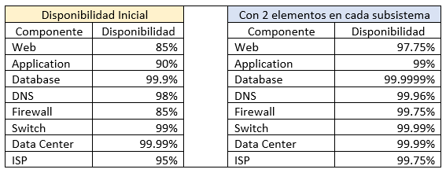
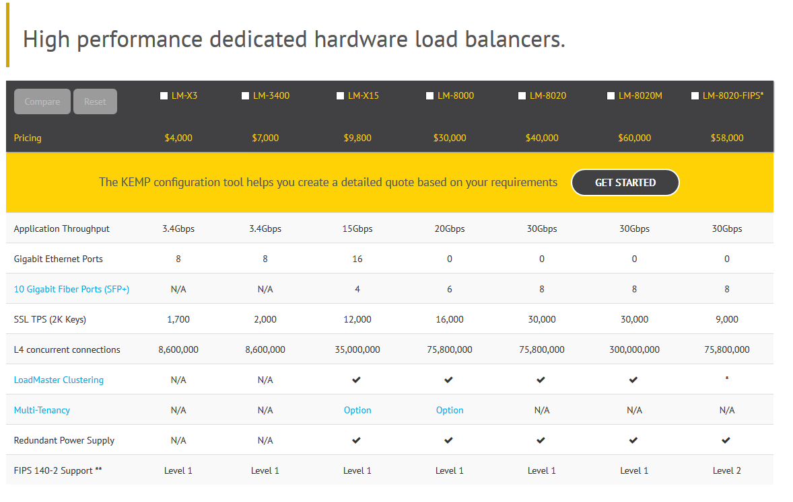

# Ejercicios 
## Servidores Web de Altas Prestaciones 2017/2018
#### Alumno: Raul Del Pozo Moreno

Ejercicios SWAP
Raul Del Pozo Moreno

Tabla de contenido
No se encontraron entradas de tabla de contenido.

___

### Tema 1

- Ejercicio T1: Buscar información sobre las tareas o servicios web para los que se usan más los programas que comentamos al principio de la sesión

	- Apache: Usado para servir páginas web estáticas/dinámicas. Es el más usado actualmente en todo el mundo.

	- Nginx: Servidor web de alto rendimiento, se usa como servidor de páginas web, balanceador o proxy para correo.

	- thttpd: Principalmente diseñado para servir contenido HTTP estático, al usar los requerimientos mínimos de un servidor HTTP, es ideal para servir grandes volúmenes de información estática.

	- Cherokee: Puede usarse como sistema embebido, balanceador de carga, dispone de panel de autentificación y permite redirecciones.

	- Node.js: Es un entorno en tiempo de ejecución multiplataforma, usa arquitectura basada en eventos y en el motor v8 de Google. Usa un solo hilo de ejecución, permitiendo las conexiones de forma asíncrona. Se usa principalmente para construir servidores web entre otros.

___

### Tema 2

- Ejercicio T2.1: Calcular la disponibilidad del sistema si tenemos dos réplicas de cada elemento (en total 3 elementos en cada subsistema)

Usando la fórmula: A_s= A_c1+(1- A_c1 )* A_c2 , podemos medir la mejora de disponibilidad  que se alcanza al mejorar el sistema, por tanto, como nos pide averiguarla con 3 elementos por subsistema, usamos los valores proporcionados en la segunda tabla.

	- A_Web = 0.9775 + (1-0.9775) \* 0.85 = 0.996625 = 99.6625%
	- A_App = 0.99 + (1-0.99) \* 0.9 = 0.999 = 99.9%
	- A_DB = 0.999999 + (1-0.999999) \* 0.999 = 0.999999999 = 99.9999999%
	- A_DNS = 0.9996 + (1-0.9996) \* 0.98 = 0.999992 = 99.9992%%
	- A_FW = 0.9775 + (1-0.9775) \* 0.8 5= 0.996625 = 99.6625%
	- A_SW = 0.9999 + (1-0.9999) \* 0.99 = 0.999999 = 99.9999%
	- A_DC = 0.9999 + (1-0.9999) \* 0.9999 = 0.99999999 = 99.999999%
	- A_ISP = 0.9975 + (1-0.9975) \* 0.95 = 0.999875 = 99.9875%
	- D_3 = A_Web \* . . . \* A_ISP
	- D_3 = A_Web \* A_App \* A_DB \* A_DNS \* A_FW \* A_SW \* A_DC \* A_ISP = 0.999875 = 99.9875%

El sistema ha mejorado hasta alcanzar una disponibilidad del 99.9875%

 - Ejercicio T2.2: Buscar frameworks y librerías para diferentes lenguajes que permitan hacer aplicaciones altamente disponibles con relativa facilidad

	- Linux-HA: Framework que proporciona una alta disponibilidad para clusters para distribuciones Linux, FreeBSD, OpenBSD, Solaris y Mac OS X.

	- Red Hat Cluster: Proporciona una alta disponibilidad y balanceo de carga en clusters. Ambas funcionalidades se pueden usar en el mismo sistema, aunque no es recomendable.

	- Oracle Solaris Cluster: Proporciona una alta disponibilidad en clusters de bases de datos, archivos compartidos en red, comercio electrónico…

- Ejercicio T2.3: ¿Cómo analizar el nivel de carga de cada uno de los subsistemas en el servidor? Buscar herramientas y aprender a usarlas, o recordar cómo usarlas.

	- Apache Benchmark: Sirve para generar carga en el servidor Apache, dándonos como resultado el comportamiento del servidor.
	Uso: ab –n (número de peticiones) –c (concurrencia) URL

	- Jmeter: Misma funcionalidad que Apache Benchmark, solo que también puede ser configurado como monitor.

	- Phoronix Test Suite: Proporciona una serie de configuraciones con las que generar carga al servidor de una forma general o enfocando el test a un componente concreto.  

	- Zabbix: Sistema de monitorización de redes, servidores, hardware… incluye un backend en C y un frontend en php. Permite configurarlo para hacer chequeos periódicos y monitorear mediante un cliente las maquinas en las que se instala.

___

### Tema 3

- Ejercicio T3.1: Buscar con que ordenes de terminal o herramientas graficas podemos configurar bajo Windows y bajo Linux el enrutamiento del tráfico de un servidor para pasar el tráfico desde una subred a otra.

	- Linux
		- Iptables (terminal), ufw, route

	- Windows
		- Route, Windows Firewall

- Ejercicio T3.2: Buscar con qué órdenes de terminal o herramientas gráficas podemos configurar bajo Windows y bajo Linux el filtrado y bloqueo de paquetes.

	- Linux
		- Iptables, ufw, ipfwadm
	- Windows
		- Windows Firewall

___

### Tema 4

- Ejercicio T4.1: Buscar información sobre cuánto costaría en la actualidad un mainframe. Comparar precio y potencia entre esa máquina y una granja web de unas prestaciones similares.

	https://www-03.ibm.com/systems/es/z/ -> Mainframe IBM Z  
	https://en.wikipedia.org/wiki/IBM_z14_(microprocessor)
	
	- No he encontrado un precio para este mainframe, puesto que para saberlas hay que contactar con IBM por telefono, y este rehusa a decir el costo, pero si ha indicado que que versiones antiguas estan entre 75.000$ y 2M$
	
- Ejercicio T4.2: Buscar informacion sobre el precio y las caracteristicas de balanceadores hardware especificos. Compara las prestaciones que ofrecen unos y otros.

	- Air Live IGR-1500 http://www.sistematics.com/Air-Live-IGR-1500/4/BAC0002
		- 4 puertos WAN
		- Balanceo interno/externo
		- Concurrencia de usuarios: 80 ~ 100
		- Precio: 325€
	- Syswan Duolinks SW34 http://www.sistematics.com/Syswan-Duolinks-SW24/4/BAC0005
		- 2 puertos WAN
		- 4 puertos
		- 16MB DRAM
		- Precio: 228€
	- Syswan Octolinks SW88 http://www.sistematics.com/Syswan-Octolinks-SW88/4/BAC0001
		- 8 puertos WAN
		- 14 puertos LAN
		- VPN
		- Precio: 788€
	- Una comparativa de la marca KEMP

- Ejercicio T4.6: Buscar información sobre los bloques de IP para los distintos países o continentes
	
	- En la siguiente pagina se pueden ver las IP asignadas a cada pais: https://lite.ip2location.com/ip-address-ranges-by-country
	
- Ejercicio T4.7: Buscar información sobre métodos y herramientas para implementar GSLB
	
	- Para implementar GLSB se pueden usar varios metodos, entre los cuales se encuentran los siguientes:
		- Round Robin
		- Least Connections
		- Least Response Time
		- Least Bandwitch
		- Least Packets
		- Round Trip Time (RTT)
___

### Tema 5

- Ejercicio T5.1: Instalar wireshark y observar cómo fluye el tráfico de red en uno de los servidores web mientras se le hacen peticiones HTTP.
	
	- Este ejercicio se ha realizado en el trabajo de la asignatura sobre Wireshark: https://github.com/rauldpm/SWAP1718/blob/master/Trabajo%20Wireshark/Wireshark.pdf -> Pagina 20

- Ejercicio T5.2: Buscar información sobre características, disponibilidad para diversos SO, etc de herramientas para monitorizar las prestaciones de un servidor

	- Nagios
		- Monitorización de servicios de red (SMTP, POP3, HTTP, NNTP, ICMP, SNMP).
		- Monitorización de los recursos de equipos hardware (carga del procesador, uso de los discos, logs del sistema) en varios sistemas operativos, incluso Microsoft Windows con los plugins NRPE_NT o NSClient++.
		- Monitorización remota, a través de túneles SSL cifrados o SSH.
		- Diseño simple de plugins, que permiten a los usuarios desarrollar sus propios chequeos de servicios dependiendo de sus necesidades, usando sus herramientas preferidas (Bash, C++, Perl, Ruby, Python, PHP, C#...).
		- Chequeo de servicios paralizados.
 		- Posibilidad de definir la jerarquía de la red, permitiendo distinguir entre host caídos y host inaccesibles.
		- Notificaciones a los contactos cuando ocurren problemas en servicios o hosts, así como cuando son resueltos (a través del correo electrónico, buscapersonas, Jabber, SMS, o cualquier método definido por el usuario junto con su correspondiente complemento).
		- Posibilidad de definir manejadores de eventos que ejecuten al ocurrir un evento de un servicio o host para resoluciones de problemas proactivas.
		- Rotación automática del archivo de registro.
		- Soporte para implementar hosts de monitores redundantes.
		- Visualización del estado de la red en tiempo real a través de interfaz web, con la posibilidad de generar informes y gráficas de comportamiento de los sistemas monitorizados, y visualización del listado de notificaciones enviadas, historial de problemas, archivos de registros....

	- Zabbix
		- Alto rendimiento y alta capacidad (posibilidad de monitorizar cientos de miles de dispositivos)
		- Auto descubrimiento de servidores y dispositivos de red
		- Monitorización distribuida y una administración web centralizada
		- Agentes nativos en múltiples plataformas
		- Posibilidad de monitorización sin agentes
		- Monitorización JMX
		- Monitorización Web
		- Configuración de permisos por usuarios y grupos
		- Métricas SLA y ITIL
		- Sistema flexible de notificación de eventos (Email, XMPP, etc)

